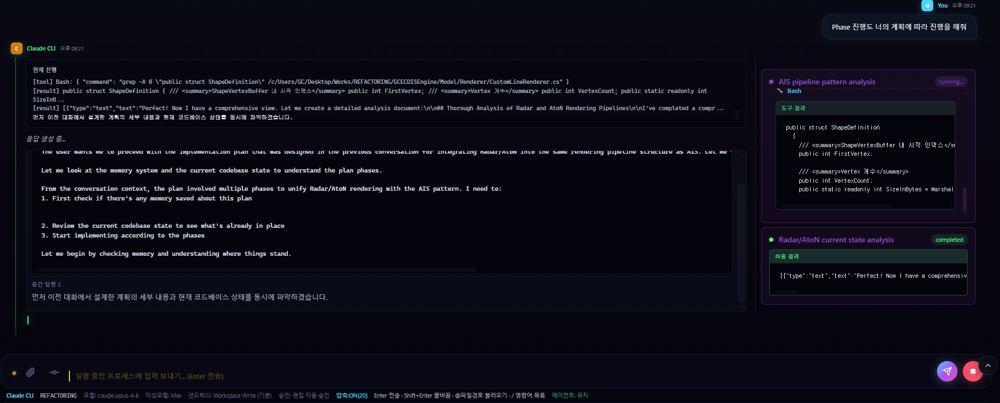

# Claude Chat

> **[한국어 README](README.ko.md)**



An Electron-based desktop chat app that provides a GUI for the Claude CLI. Supports markdown rendering, file attachments, code review, subagents, i18n (Korean/English), and more.

## Prerequisites

### 1. Node.js

Download and install the LTS version from [nodejs.org](https://nodejs.org/).

```bash
node --version   # v18+ recommended
npm --version
```

### 2. Claude CLI

This app internally calls [Claude CLI (Claude Code)](https://docs.anthropic.com/en/docs/claude-code).

```bash
npm install -g @anthropic-ai/claude-code
```

Login after install:

```bash
claude login
```

A browser window will open — complete login with your Anthropic account.

Verify:

```bash
claude --version
```

## Installation

### Installer (recommended)

Download `Claude Chat Setup x.x.x.exe` from the [Releases](../../releases) page and run it.

### Build from source

```bash
git clone <repository-url>
cd "Claude Chat"
npm install
npm run build
```

The installer will be generated at `dist/Claude Chat Setup x.x.x.exe`.

Portable build (no installation required):

```bash
npm run build:portable
```

### Development mode

```bash
npm install   # first time only
npm start
```

## Build Requirements

| Tool | Min Version | Purpose |
|------|-------------|---------|
| Node.js | 18+ | Runtime & npm |
| npm | 9+ | Package manager |
| Git | 2.x | Source clone & git integration |
| Windows | 10+ | Target OS |

Additional dependencies are installed automatically via `npm install` (Electron, electron-builder, etc.).

## Usage

### Basics

1. Launch the app to see the welcome screen
2. Type a question or request in the input box and press **Enter** to send
3. Claude responds via streaming with real-time markdown/code rendering
4. Press **Stop** button or **Esc** to interrupt during streaming

### Keyboard Shortcuts

| Shortcut | Action |
|----------|--------|
| `Enter` | Send message |
| `Shift + Enter` | New line |
| `Esc` | Stop streaming / Close menu |
| `Ctrl + N` | New conversation |
| `Ctrl + P` | Open new project |
| `Ctrl + B` | Toggle sidebar |
| `Ctrl + L` | Focus input |

### File Attachments

Use the **Attach** button next to the input box to add files.

- Images: PNG, JPG, GIF, WebP, SVG, etc. (under 20MB)
- PDF (under 10MB)
- Documents: DOC, DOCX, XLS, XLSX, PPT, etc.
- Text files (under 180KB)
- Archives: ZIP, TAR, 7Z, etc.

You can also type `@filepath` in the input to load file contents directly.

### Slash Commands

Type `/` in the input box to see the available command list.

| Command | Description |
|---------|-------------|
| `/model [name]` | Change model (opus, sonnet, haiku, etc.) |
| `/reasoning [low\|medium\|high\|max]` | Set reasoning effort level |
| `/sandbox [mode]` | Change sandbox mode |
| `/review` | Code review uncommitted changes |
| `/file [path]` | Load file contents |
| `/compress` | Compress conversation context |
| `/clear` | Clear current conversation |
| `/resume [session-id]` | Resume a previous session |
| `/usage` | Check token usage |
| `/settings` | Open settings panel |
| `/help` | Full command list |

### Project Management

- The **sidebar** organizes conversations by project (working directory)
- Press `Ctrl + N` to open a new project folder
- Create and switch between multiple conversations under each project

### Approval Policies

When Claude requests file modifications or command execution, behavior depends on the approval policy.

| Policy | Behavior |
|--------|----------|
| Default | Confirm every action |
| Accept Edits | Auto-approve file edits |
| Auto | Auto-approve safe operations |
| Bypass Permissions | Auto-approve everything |
| Plan | Show plan only, no execution |

Check and change the current policy from the bottom status bar.

### Subagents

Use `/subagent [name] [prompt]` or `/auto-agent [task]` to create parallel agents and distribute work. Subagent activity is displayed in a dedicated side panel with real-time progress tracking.

### Settings

Open via the **Settings** button in the sidebar or `/settings` command. Manage:

- **General**: UI language (Korean/English), model, effort level, thinking, fast mode
- **Permissions**: Allow/deny/ask rules
- **Plugins**: Enable/disable plugins
- **Hooks**: Pre/PostToolUse, Stop, SessionStart, etc.
- **Advanced**: Environment variables, cleanup period, gitignore

### Git Integration

Use the **Commit** button next to the input to commit changes with an AI-generated commit message. Use `/review` for code review.

## License

MIT

contact :worbswo@naver.com
